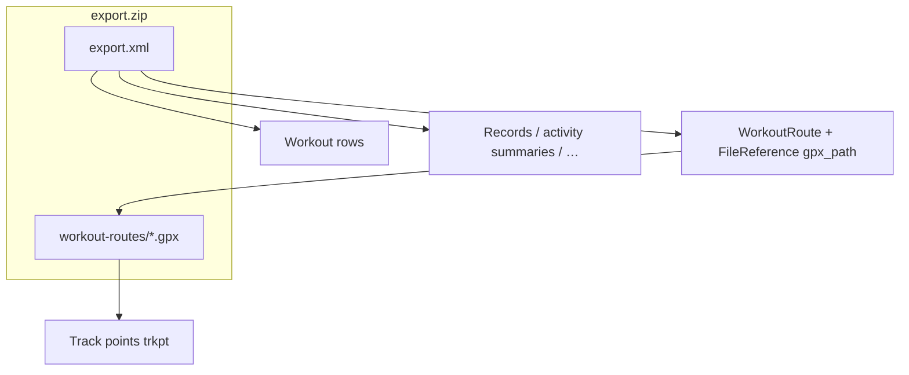
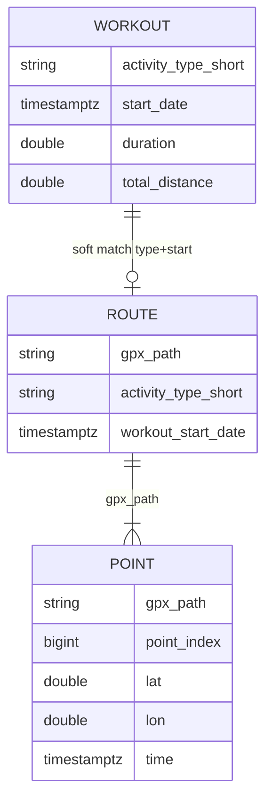
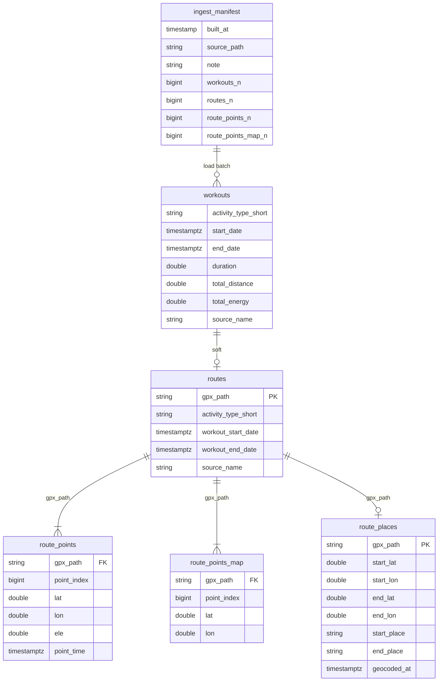

# Data model (export → scanner → local DuckDB)

How a Health app **export.zip** becomes tables you can query and map.

See also: [DESIGN.md](DESIGN.md), [ROADMAP.md](ROADMAP.md).

Last updated: 2026-08-30.

---

## Big picture

```text
export.zip  (full snapshot, outside git)
    │
    ▼
extension table functions   (scan; occasional, can be slow)
    │
    ▼
output/healthkit_store.duckdb  (local database; gitignored)
    │
    ▼
SQL / map notebook          (fast, everyday)
```

| Piece | What it is |
|---|---|
| **Extension** | C scanner: reads a zip/xml path, returns rows. No permanent storage. |
| **Local database** | One DuckDB file with clear table names. Built by `just build-db`. |
| **Notebooks** | Explore metrics *or* map walks — they should prefer the database, not re-scan the zip. |

---

## What is inside the zip



- Each export is usually a **full dump**, not a “only new data” package.
- Outdoor walks/hikes often have a GPX; indoor workouts often do not.

---

## Scanner (table functions)

No persistent schema — each call scans `path`:

| Function | One row means |
|---|---|
| `healthkit_workouts(path)` | A workout summary (type, duration, distance, energy, dates) |
| `healthkit_workout_routes(path)` | A GPS route index (`gpx_path` + parent workout dates/type) |
| `healthkit_workout_route_points(path)` | One GPS point (`lat`/`lon`/…) |
| `read_healthkit_export(path)` | A Health record sample |
| `healthkit_activity_summaries(path)` | One day of rings |



**Joins**

| From → to | Key | Notes |
|---|---|---|
| Route → points | **`gpx_path`** | Strong — use for maps |
| Workout → route | type + start/end (+ source) | Soft — good enough for UI |

---

## Local database layout

**File:** `output/healthkit_store.duckdb` (under gitignored `output/`)



| Table / view | Purpose |
|---|---|
| `workouts` | Workout summaries loaded into the DB |
| `routes` | Routes that have a `gpx_path` |
| `route_points` | Full GPS detail |
| `route_points_map` | **Downsampled** points for drawing maps (~≤1500 points per route) |
| `route_places` | Start/end coordinates + reverse-geocoded labels (`just geocode-places`) |
| `walk_photos` | Photos matched to routes via Photos.sqlite (`just photos-for-walks`) |
| `journeys` / `journey_sections` | Multi-section trails (e.g. GNW); YAML import |
| `ingest_manifest` | When the DB was built and from what |

Default `just build-db` loads **Walking** and **Hiking** (override with `activities=`). Other activity types can be added the same way later.

---

## How to build and use it

```bash
# Build / rebuild the local database from a real export (outside the repo)
just build-db export_zip=/path/to/export.zip

# Optional: only some activities (comma-separated)
just build-db export_zip=/path/to/export.zip activities=Walking,Hiking,Running

# Open it
duckdb output/healthkit_store.duckdb
SHOW TABLES;
SELECT * FROM ingest_manifest;
SELECT activity_type_short, workout_start_date, gpx_path
FROM routes ORDER BY workout_start_date DESC LIMIT 10;

# Map walks (reads the DB only — no zip scan)
just map-walks
```

```sql
-- Points for one route (map layer)
SELECT point_index, lat, lon, ele, point_time
FROM route_points_map
WHERE gpx_path = '/workout-routes/route_….gpx'
ORDER BY point_index;
```

---

## Incremental exports (later)

Apple still gives **full** zips. Updating over time means **merge into this database** (append new `gpx_path`s, replace points if a GPX changed), not “diff zip format”. Options are spelled out in [ROADMAP.md](ROADMAP.md) (*Progressive exports & local database*).

---

## Python helper

Reusable (non-notebook) API:

```text
python/healthkit_store/
  store.py   # HealthkitStore — open DB, list_routes, route_points, build_from_export
  maps.py    # build_route_map, downsample_points (Folium, no marimo)
```

`notebooks/map_walks.py` is UI-only. `scripts/build_health_db.py` calls `HealthkitStore.build_from_export`.

### Start / end place names

The Health app export does **not** store suburb/street labels on workouts. Derive them:

1. Take first/last GPS point per `gpx_path` (`HealthkitStore.route_endpoints`).
2. Reverse-geocode with OpenStreetMap **Nominatim** (free, no key) via `enrich_with_places`.
3. Cache under `output/geocode_cache.json` (gitignored) so repeats are offline.

Materialise with `just geocode-places` (or `just geocode-places limit=50`) into **`route_places`**.
`list_routes` / `just list-walks` join this table when present.


## Privacy

- Real zips and `output/healthkit_store.duckdb` stay **off git**.
- GPS is precise location — treat carefully.
